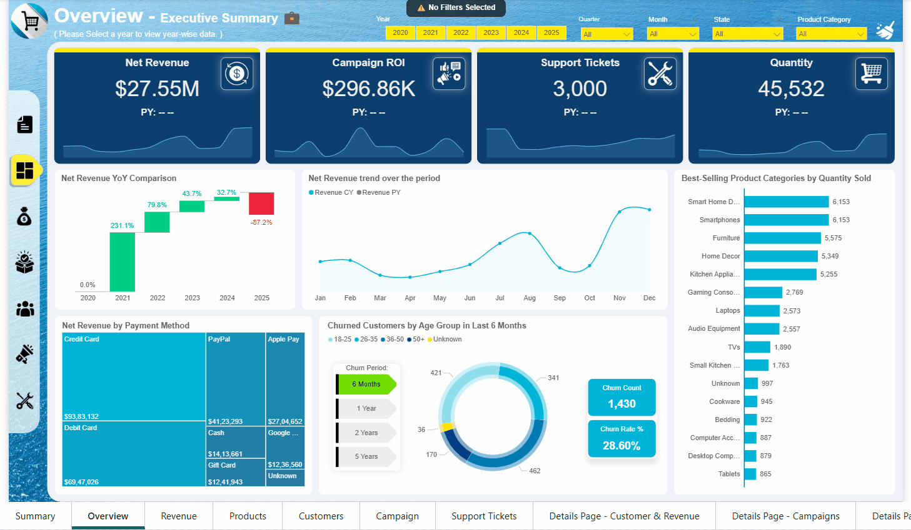
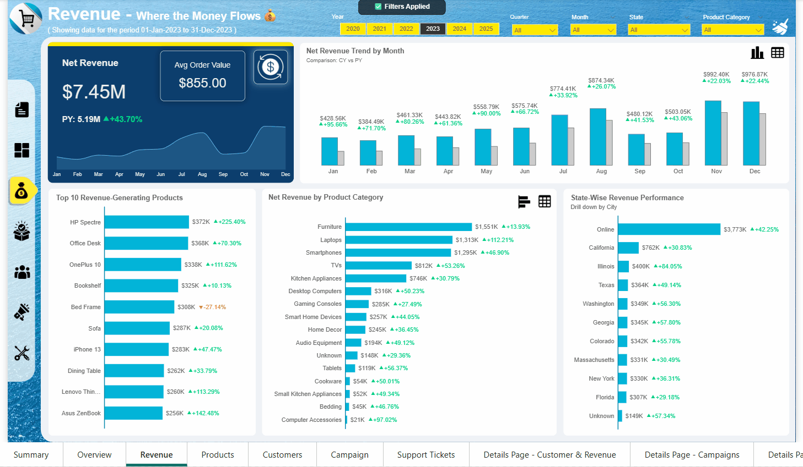
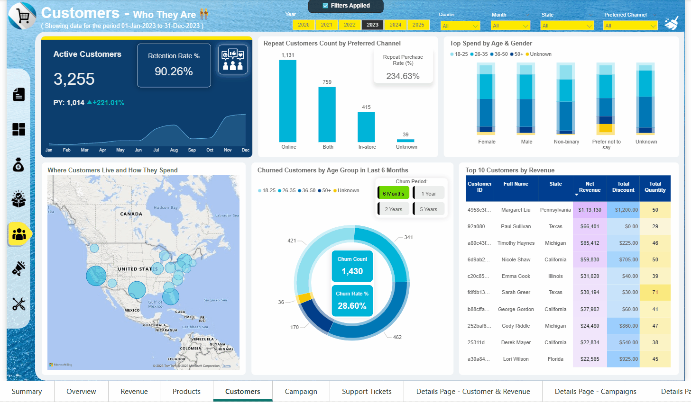
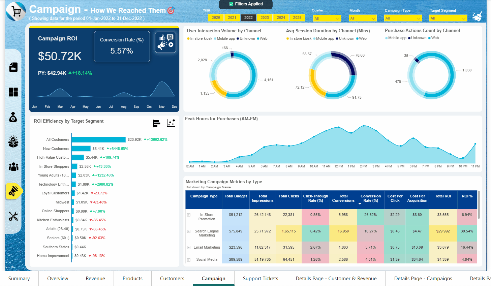

# Omnichannel Retail Behaviour and Performance Analytics Dashboard  
This repository showcases a comprehensive analytics solution for a fictional retail company, **OmniMart Pvt Ltd**, designed to analyze customer behavior, campaign performance, and operational KPIs across multiple channels.

It includes business documentation, process flows, wireframes, SQL logic, Power BI dashboards, data dictionary, UAT artifacts, and executive summaries - all structured for clarity, traceability, and stakeholder usability.

---

## Branding & Stakeholder Disclaimer!
- All company names, stakeholder personas, and branding elements in this repository are **fictional** and used solely for illustrative purposes.
- The logo is **AI-generated** to simulate a realistic enterprise environment.
- No real individuals, organizations, or proprietary data are represented.

---

## Table of Contents  
- [Project Overview](#project-overview)  
- [Business Objectives](#business-objectives)  
- [Data Source and Processing](#data-source-and-processing)  
- [Workflow and Approach](#workflow-and-approach)  
- [Tools Used](#tools-used)  
- [Data Architecture & Modeling](#data-architecture--modeling)  
- [Preview](#preview)  
  - [Process Flow Diagrams](#process-flow-diagrams)  
  - [Wireframes](#wireframes)  
- [Key Insights](#key-insights)  
- [Recommendations](#recommendations)  
- [Action Plan](#action-plan)  
- [Repository Structure](#repository-structure)    
- [Documentation](#documentation)  
- [Next Steps](#next-steps)  

---

## Project Overview  
This analysis was conducted as part of a **business intelligence initiative** to evaluate the omnichannel retail behavior and performance of a fictional retail brand **OmniMart Pvt Ltd** over the period **March 2020 – March 2025**.  

The project helps stakeholders (Sales, Marketing, Support, and Leadership teams) gain insights into:  
- Revenue trends across regions & products
- Product performance and satisfaction ratings  
- Customer behaviour, churn, and retention  
- Campaign ROI & conversions  
- Support tickets & SLA compliance  

The outcome is a fully documented **Power BI dashboard**, complemented by **SQL-based data transformations** and **business documentation (BRD, UAT, Executive Summary)**.  

---

## Business Objectives

**What OmniMart Aims to Achieve with the Power BI Dashboard ?**

**Accelerate Decision-Making:**
- Deliver real-time, actionable insights to decision-makers across sales, marketing and support functions. 

**Unify Omnichannel Performance Visibility:**
- Integrate sales, customer, campaign and support data from offline and online channels into one platform.

**Enhance Customer Engagement & Retention:**
- Track churn, campaign responses and SLA metric, CSAT to improve satisfaction and loyalty.

**Foster Accountability Through Role-Based Reporting:**
- Provide tailored dashboards with access control for executives, managers, analysts and support teams.

**Support Operational Efficiency and Data Trust:**
- Replace manual reports with automated, validated dashboards powered by SQL and Power BI.

---

## Data Source and Processing
**About the Source:**
- The dataset was sourced from **Kaggle website,** a popular platform for hosting datasets. 
- Kaggle hosts a wide range of community-contributed datasets, making it a valuable resource for analysis projects.
- Though based on a Kaggle dataset, all transformations, cleaning rules, and KPIs were independently defined for OmniMart’s fictional scenario.

**Description of the Dataset:**
- **Platform**: [Kaggle - Retail Customer & Transaction Dataset](https://www.kaggle.com/)  
- **Period Covered**: March 2020 – March 2025  
- **Files Used**:  
  - `Customers.csv`  
  - `Transactions.csv`  
  - `Interactions.csv`  
  - `Campaigns.csv`  
  - `Customer Reviews.csv`  
  - `Support Tickets.csv`  

**Data Preparation & Processing:**
- Verified file structures and column definitions in Excel.
- Checked quality: minor missing values (e.g., phone, discounts), assumed all amounts in **USD**.
- Imported datasets into MySQL for structured cleaning and transformation.

**Data Cleaning:**
- Fixed missing values (dates, budget, ratings, product names).
- Removed duplicates (customer_id, emails).
- Validated formats (emails, phone numbers, names).
- Flagged orphan records; identified outliers in age, prices, satisfaction scores.
- Standardized store location (City/State).
- Standardized categorical values (e.g., store location formats).
- Recalculated and validated campaign KPIs.

---

## Workflow and Approach  
1. Requirement Gathering (sample request email).  
2. BRD creation (objectives, KPIs, business case questions, user stories, use cases).  
3. Process Mapping (current & future state in Lucidchart).  
4. Wireframes (Balsamiq).  
5. Analysis Question Framework (26 business questions).  
6. Database Creation, Data Insert, Data Cleaning & Preparation (MySQL).  
7. SQL Development (26 queries aligned to KPIs).
8. Create connection between MySQL and Power BI through IMPORT MODE
9. Power BI Dashboard Development (ETL, modeling, DAX measures, slicers, drill-through, custom tooltip pages).  
10. UAT (plan, test cases, defect tracker, sign-off).  
11. Delivery (final dashboard, supporting docs).  

---

## Tools Used  
- **Excel** - Initial Profiling, UAT Documentation 
- **Lucidchart** - Process Flow Diagrams  
- **Balsamiq** - Wireframes  
- **MySQL** - Data storage, Data Cleaning, KPI transformations  
- **Power BI** - Dashboard development (DAX, visuals, interactions)  
- **MS Word / PowerPoint** - Documentation and Executive Summary  

---

## Data Architecture & Modeling

### SQL Entity Relationship Diagram (ERD)
The ERD below shows relationships across customers, transactions, campaigns, and tickets.
  

### Power BI Data Model
The Power BI Data Model reflects fact-dimension schema optimized for reporting.
  

---

## Preview

### Process Flow Diagrams  

| Current State | Future State |
|---------------|--------------|
|  |  |

---

### Wireframes (Dashboard Design Phase)  

| Summary Page | Overview Page | Revenue Page |
|--------------|---------------|--------------|
|  |  |  |

| Products Page | Customers Page | Campaigns Page | Support Tickets Page |
|---------------|----------------|----------------|----------------------|
|  |  |  |  |

---

## Dashboard Outputs  

### Dashboard Preview (GIF Animations)  
| Summary Page | Overview Page | Revenue Page |
|--------------|--------------|----------------|
|  |  |  |

| Products Page | Customers Page | Campaigns Page | Support Tickets Page |
|---------------|----------------|----------------|----------------------|
|  |  |  |  |

---

## Key Insights
- Gross Revenue before discounts was $27.79M, with total discounts reducing it by $0.24M, resulting in a net revenue of $27.55M

- Net revenue generated is $27.55M, with 'Furniture' category contributing the highest share of $6.1M

- 'Google Nest' is the best-selling item with 1,359 units sold, while 'Sheets' leads in quality with an average rating of 5.0

- 'California' state leads with the highest customer base of 873 individuals out of 5,000 total customers

- 'Search Engine Marketing' campaigns delivered the highest ROI of $162.64k, with top performance seen in the 'Home Improvement' audience segment

- 'Shipping' was the most reported issue type, with 436 tickets raised, 379 of them were resolved, averaging 37.67 hours to close and a customer satisfaction score of 3.52

Explore entire analysis findings in below folders:
- [04_SQL_Queries](../04_SQL_Queries/README.md)
- [05_PowerBI_Dashboard](../05_PowerBI_Dashboard/README.md)
- [08_Executive_Summary](../08_Executive_Summary/Executive_Summary_Presentation.pdf)

---

## User Acceptance Testing (UAT)  

The UAT was designed to validate the dashboard’s functional requirements, business expectations, and stakeholder needs.  
It includes:  
- UAT Plan & Schedule  
- Test Case Matrix & Coverage  
- Defect Tracker  
- Traceability Matrix  
- Final Sign-off  

[View UAT Workbook](07_User_Acceptance_Testing/UAT_Execution_Report.xlsx)  

---

## Executive Summary  

A concise **management-level presentation** summarizing:  
- Key findings & insights  
- Recommendations & next steps  
- Business impact  

[Download Executive Summary (PDF)](08_Executive_Summary/Executive%20Summary%20Presentation.pdf)  

---

## Recommendations
**1. Revenue:**
- Focus marketing efforts on high-revenue categories like Furniture ($6.13M), Smartphones ($4.94M) and Laptops ($3.95M).
- Capitalize on Nov ($3.71M) and Dec ($3.78M) surges with festive promotions, bundled deals and upselling.
- Optimize ads, personalized recommendations and loyalty rewards to further grow the $13.98M Online revenue channel.
- Promote preferred payment methods like Credit Cards ($9.38M across 10,097 transactions) to boost average order value and checkout speed.
- Reevaluate low-revenue categories under $500K such as Tablets, Cookware, Small Kitchen Appliances, Bedding and Computer Accessories for promotional pushes.
- Develop location-specific offers to lift sales in Florida ($1.19M), Colorado ($1.22M) and similar low-performing states.

**2. Product:**
- Increase stock levels by 20% for bestsellers (Bed Frame, Office Desk, Sofa  -  each $1.2M+) before seasonal peaks.
- Expand promoting Smart Home Devices (6,153 units), Smartphones (6,153 units) and Furniture (5,575) with seasonal and event-based campaigns.
- Offer retention incentives to first-time buyers in Smartphones (608), Smart Home Devices (600) and Kitchen Appliances (529).
- Launch clearance or repositioning strategies for low-volume categories like Bedding, Computer Accessories, Desktop Computers and Tablets.
- Pair high-rated products such as iMac (5★) and Lenovo IdeaCentre (5★) with lower-selling items to boost sales.
- Highlight 4.5★+ rated products in ads to reinforce trust and improve conversion rate.

**3. Customers:**
- Improve the 27.86% retention rate and reduce the 28.6% churn (1,430 in 6 months) by focusing on high-churn segments 26 - 35 (482 customers) and 50+ (170 customers) through tailored reactivation offers.
- Boost lifetime value from top-spending segments: Female 36 - 50 ($5.23M), Male 36 - 50 ($5.16M), and Male 26 - 35 ($4.27M) with premium product bundles, early-bird offers, and loyalty perks.
- Leverage online repeat buyers (2,058 customers, 83.94% repeat purchase rate) through loyalty points, early access sales, and subscription models.
- Engage top spenders like Tracey Patterson ($1.44M) and Margaret Liu ($1.21M) with exclusive VIP programs to drive advocacy and repeat orders.
- Target high-value states California ($5.08M), Texas ($3.57M), Florida ($2.99M) with geo-specific promotions while lifting lower-revenue states like Georgia ($1.20M) and North Carolina ($1.12M).

**4. Campaigns:**
- Prioritize Search Engine Marketing (ROI - 32.31%) and Email Marketing (ROI - 15.92%) for future budget allocation, scaling high-ROI channels while reducing spend on low-ROI mediums like TV (0.16%) and Radio (0.34%).
- Optimize In-Store Promotions (Conversion Rate - 29.05%) by integrating QR codes and digital coupons to bridge offline-to-online conversions.
- Improve underperforming channels (e.g., Online Display ROI 1.13%, Social Media ROI 2.05%) by A/B testing creatives, tightening audience targeting, and leveraging retargeting strategies.
- Expand campaigns for Home Improvement (ROI - $59K) while testing niche targeting for high-engagement segments like Technology Enthusiasts and Online Shoppers.
- Concentrate ad delivery during peak purchase hours 12 PM - 3 PM and 10 AM - 11 AM when purchase volume exceeds 750 orders/hour.

**5. Support Tickets:**
- Ticket volume reached 3,000 in the latest period, with a sharp rise since mid-2023 and a peak of 220 in Jan 2025; capacity scaling is critical.
- Yearly trend shows a gradual rise in CS scores until late 2023, then fluctuating between 3.2 - 3.7, signalling stability but no significant improvement.
- Only 28.39% of tickets are resolved within 24 hrs, highlighting the need for faster triaging and improved first-contact resolution.
- High-priority tickets resolve in 24.32 hrs with a 3.48 CS score, but low-priority ones take 65.35 hrs and yield the lowest CS score (3.20), suggesting disproportionate delays.
- Shipping, Account Issues, and Billing each exceed 420 tickets; Account Issues have the longest resolution (51.13 hrs) and below-average satisfaction (3.29).
- Website Issues and Product Inquiries average 48+ hrs resolution, indicating system/process inefficiencies in these categories.
- “Closed without Resolution” cases take 124 hrs and deliver a poor 1.89 CS score; these should be minimized through escalation protocols.

---

## Action Plan
**Implement Targeted Revenue Strategies:**
Focus on high-performing states like California, Texas, and Florida while running pilot campaigns in underperforming regions to close the gap.

**Optimize Product Mix:**
Increase inventory for top sellers and phase out or repackage low-margin SKUs, using seasonal demand trends to guide planning.

**Enhance Customer Segmentation:**
Launch tailored marketing for high-value segments (e.g., Female 36-50, Male 26-35) while improving engagement for underrepresented demographics.

**Refine Campaign Investments:**
Shift budget toward high-ROI channels such as Search Engine Marketing, Email, and In-Store Promotions, while testing new low-cost digital avenues.

**Streamline Support Processes:**
Address high ticket volumes in categories like Shipping and Account Issues through automation, improved FAQs, and priority-based resolution workflows.

---

## Repository Structure  

| Folder | Description |
|--------|-------------|
| [01_Business_Documents](01_Business_Documents/) | Business request email, BRD, business case questions, user stories, and use cases. |
| [02_Process_Flow_Diagrams](02_Process_Flow_Diagrams/) | Current vs. future state process flow diagrams. |
| [03_Wireframes](03_Wireframes/) | Dashboard wireframes for all report pages. |
| [04_SQL_Queries](04_SQL_Queries/) | SQL scripts for table setup, cleaning, analysis queries, ERD, and output exports. |
| [05_PowerBI_Dashboard](05_PowerBI_Dashboard/) | PBIX file, PDF export, animated GIFs of pages, and Power BI data model. |
| [06_Data_Dictionary](06_Data_Dictionary/) | Data dictionary (`.md`) with table/column-level details and source reference. |
| [07_User_Acceptance_Testing](07_User_Acceptance_Testing/) | UAT workbook with plan, test cases, defect tracker, traceability, and sign-off. |
| [08_Executive_Summary](08_Executive_Summary/) | Final stakeholder presentation (PPTX & PDF). |

---

## Author  

**Sudhagar**  
Business Intelligence Analyst | SQL | Power BI | Data Analytics  

📧 [Email](mailto:your.email@example.com) | 💼 [LinkedIn](https://www.linkedin.com)  

---

⭐ If you found this project helpful, please consider giving the repository a **star**!  
