# Omnichannel Retail Behaviour and Performance Analytics Dashboard  

This repository showcases a comprehensive analytics solution for a fictional retail company, **OmniMart Pvt Ltd**, designed to analyze customer behavior, campaign performance, and operational KPIs across multiple channels.

It includes business documentation, process flows, wireframes, SQL logic, Power BI dashboards, data dictionary, UAT artifacts, and executive summaries - all structured for clarity, traceability, and stakeholder usability.

---

## Branding & Stakeholder Disclaimer

- All company names, stakeholder personas, and branding elements in this repository are **fictional** and used solely for illustrative purposes.
- The logo is **AI-generated** to simulate a realistic enterprise environment.
- No real individuals, organizations, or proprietary data are represented.

---

## Table of Contents  
- [Project Overview](#project-overview)  
- [Business Objectives](#business-objectives)  
- [Data Source and Processing](#data-source-and-processing)  
- [Workflow and Approach](#workflow-and-approach)  
- [Tools Used](#tools-used)  
- [Preview](#preview)  
  - [Process Flow Diagrams](#process-flow-diagrams)  
  - [Wireframes](#wireframes)
- [Data Architecture & Modeling](#data-architecture-&-modeling)
- [Key Insights](#key-insights)  
- [Recommendations](#recommendations)  
- [Action Plan](#action-plan)  
- [Repository Structure](#repository-structure)  
- [Documentation](#documentation)  
- [Next Steps](#next-steps)  

---

## Project Overview  

This analysis was conducted as part of a **business intelligence initiative** to evaluate the omnichannel retail behavior and performance of a fictional retail brand **OmniMart Pvt Ltd** over the period **March 2020 – March 2025**.  

The project helps stakeholders (Sales, Marketing, Support, and Leadership teams) gain insights into:  
- Revenue trends across regions & products
- Product performance and satisfaction ratings  
- Customer behaviour, churn, and retention  
- Campaign ROI & conversions  
- Support tickets & SLA compliance  

The outcome is a fully documented **Power BI dashboard**, complemented by **SQL-based data transformations** and **business documentation (BRD, UAT, Executive Summary)**.  

---

## Business Objectives

**What OmniMart Aims to Achieve with the Power BI Dashboard ?**

**Accelerate Decision-Making:**
- Deliver real-time, actionable insights to decision-makers across sales, marketing and support functions. 

**Unify Omnichannel Performance Visibility:**
- Integrate sales, customer, campaign and support data from offline and online channels into one platform.

**Enhance Customer Engagement & Retention:**
- Track churn, campaign responses and SLA metric, CSS to improve satisfaction and loyalty.

**Foster Accountability Through Role-Based Reporting:**
- Provide tailored dashboards with access control for executives, managers, analysts and support teams.

**Support Operational Efficiency and Data Trust:**
- Replace manual reports with automated, validated dashboards powered by SQL and Power BI.

---

## Data Source and Processing

### About the Source 
- The dataset was sourced from Kaggle website, a popular platform for hosting datasets. 
- Kaggle hosts a wide range of community-contributed datasets, making it a valuable resource for analysis projects.
- This dataset contains fictional or sample retail data gathered from various sources within a retail business environment.

### Description of the Dataset
- **Platform**: [Kaggle - Retail Customer & Transaction Dataset](https://www.kaggle.com/)  
- **Period Covered**: March 2020 – March 2025  
- **Files Used**:  
  - `Customers.csv`  
  - `Transactions.csv`  
  - `Interactions.csv`  
  - `Campaigns.csv`  
  - `Customer Reviews.csv`  
  - `Support Tickets.csv`  

### Data Preparation & Processing
- Verified file structures and column definitions in Excel.
- Checked quality: minor missing values (e.g., phone, discounts), assumed all amounts in **USD**.
- Imported datasets into MySQL for structured cleaning and transformation.

### Data Cleaning
- Fixed missing values (dates, budget, ratings, product names).
- Removed duplicates (customer_id, emails).
- Validated formats (emails, phone numbers, names).
- Flagged orphan records; identified outliers in age, prices, satisfaction scores.
- Standardized store location (City/State).
- Standardized categorical values (e.g., store location formats).
- Recalculated and validated campaign KPIs.

---

## Workflow and Approach  

1. Requirement Gathering (sample request email).  
2. BRD creation (objectives, KPIs, user stories, use cases).  
3. Process Mapping (current & future state in Lucidchart).  
4. Wireframes (Balsamiq).  
5. Analysis Question Framework (26 business questions).  
6. Data Cleaning & Preparation (SQL).  
7. SQL Development (26 queries aligned to KPIs).  
8. Power BI Dashboard Development (DAX measures, modeling, slicers, drill-through, custom tooltip pages).  
9. UAT (plan, test cases, defect tracker, sign-off).  
10. Delivery (final dashboard + supporting docs).  

---

## Process Flow Diagrams  

| Current State | Future State |
|---------------|--------------|
| 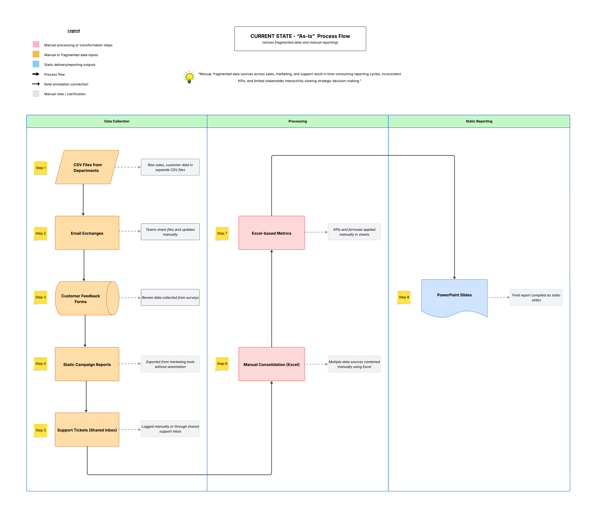 | 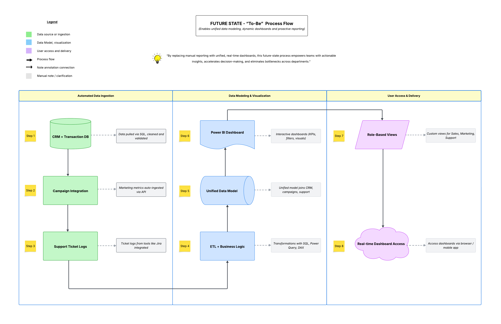 |

---

## Wireframes (Dashboard Design Phase)  

| Summary Page | Overview Page | Revenue Page |
|--------------|---------------|--------------|
| 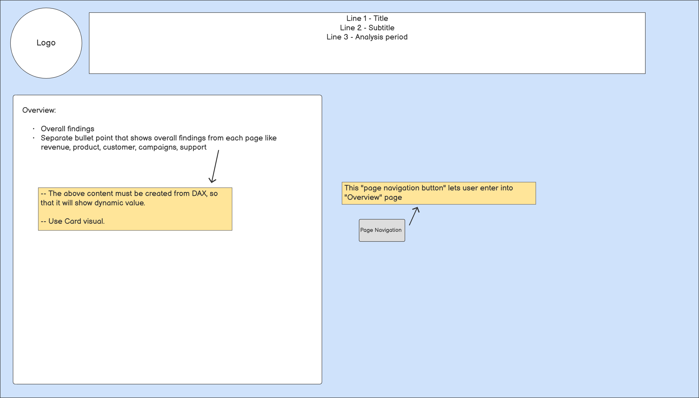 | 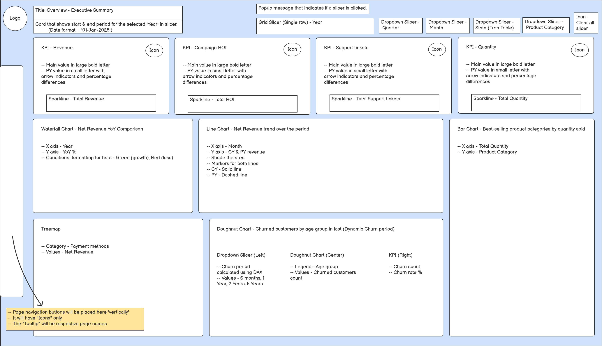 | 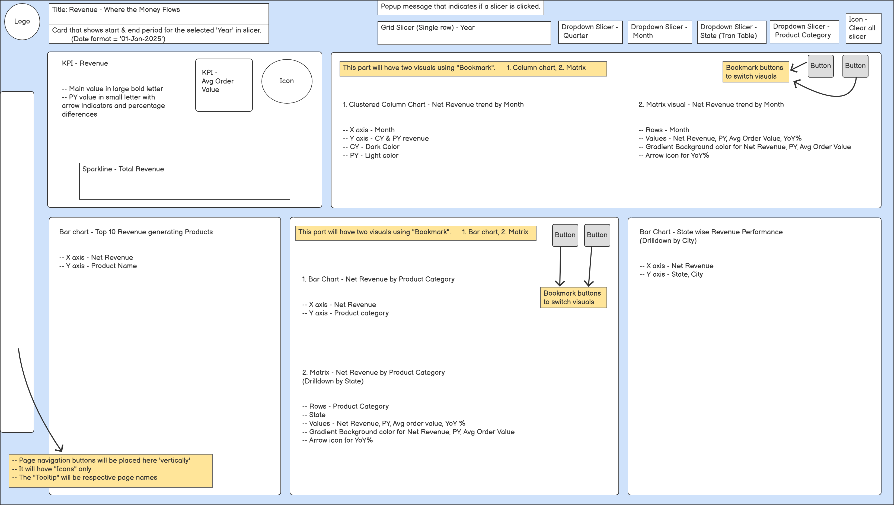 |

| Products Page | Customers Page | Campaigns Page | Support Tickets Page |
|---------------|----------------|----------------|----------------------|
| 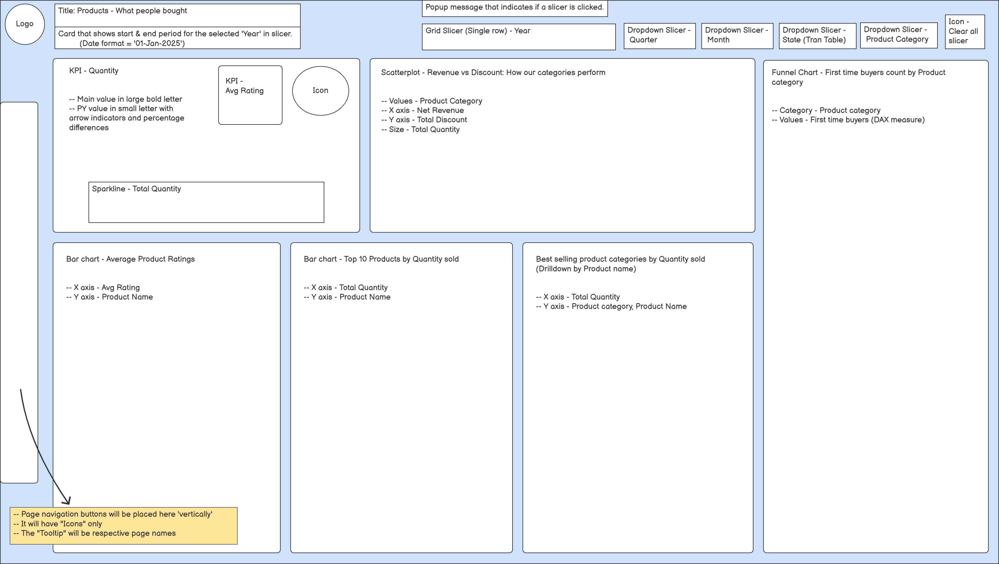 | 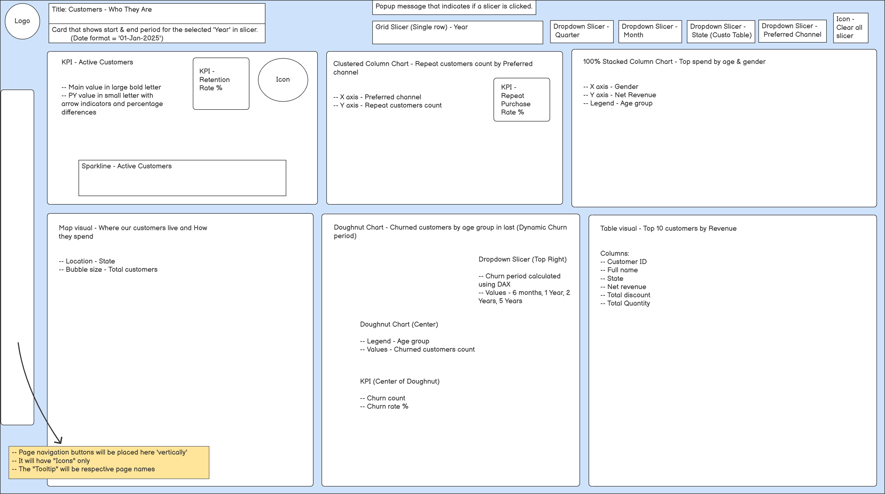 | 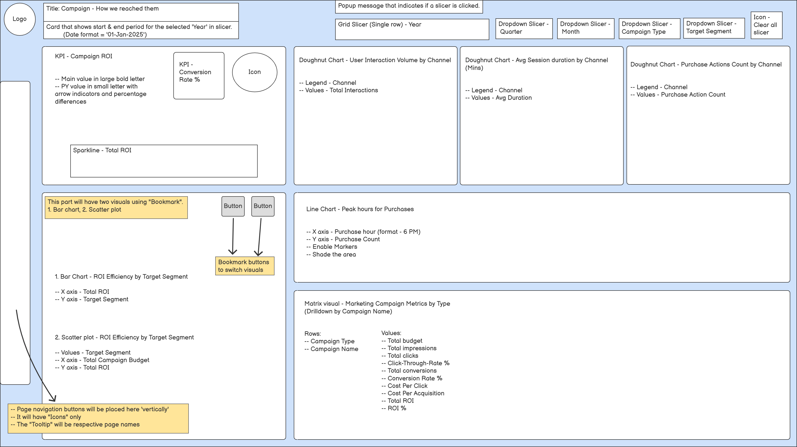 | 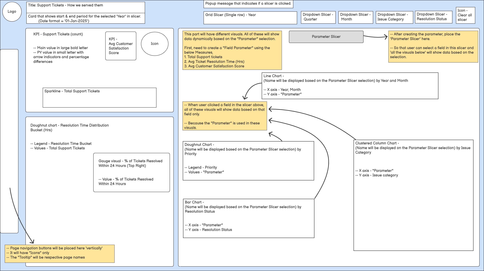 |

---

## Data Model & ERD  

**Power BI Data Model**  
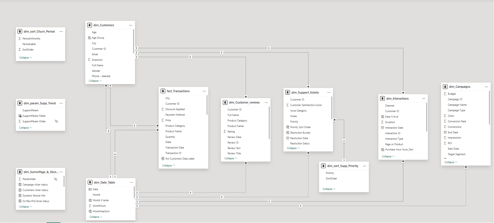  

**SQL ERD**  
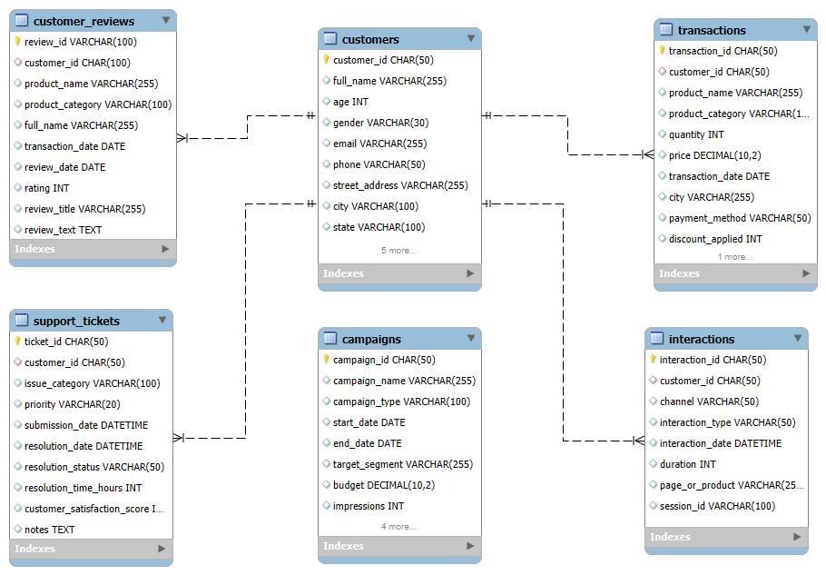  

---

## Sample Dashboard Outputs  

### Dashboard Preview (GIF Animations)  
| Summary Page | Revenue Page | Customers Page |
|--------------|--------------|----------------|
| 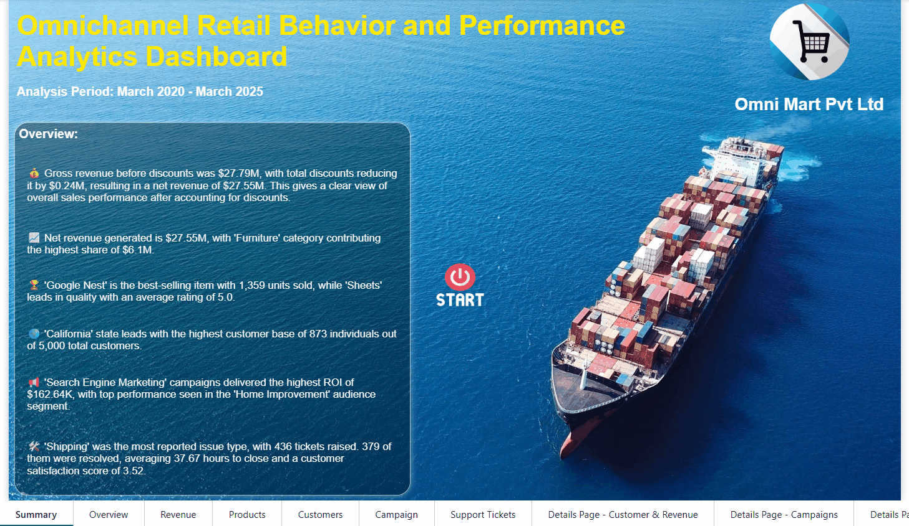 | 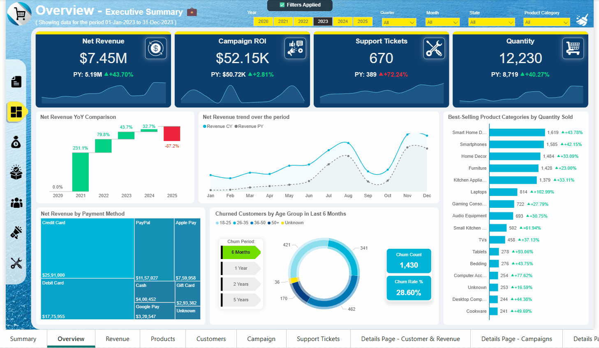 | 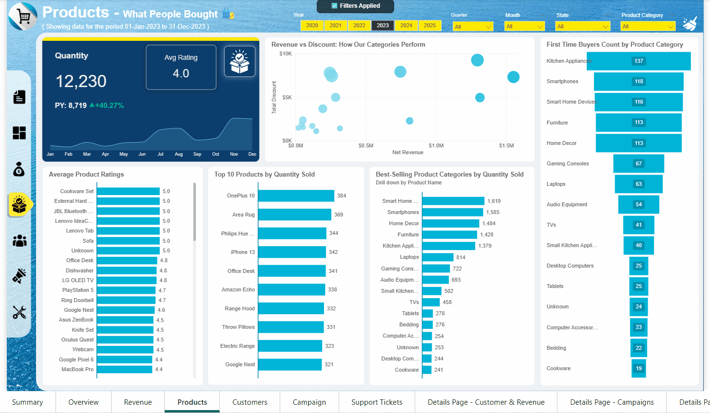 |

---

## ✅ User Acceptance Testing (UAT)  

The UAT was designed to validate the dashboard’s functional requirements, business expectations, and stakeholder needs.  
It includes:  
- UAT Plan & Schedule  
- Test Case Matrix & Coverage  
- Defect Tracker  
- Traceability Matrix  
- Final Sign-off  

📄 [View UAT Workbook](07_User_Acceptance_Testing/UAT_Execution_Report.xlsx)  

---

## 📑 Executive Summary  

A concise **management-level presentation** summarizing:  
- Key findings & insights  
- Recommendations & next steps  
- Business impact  

📄 [Download Executive Summary (PDF)](08_Executive_Summary/Executive%20Summary%20Presentation.pdf)  

---

## 🗂 Repository Structure  

| Folder | Description |
|--------|-------------|
| [01_Business_Documents](01_Business_Documents/) | Business request email, BRD, business case questions, user stories, and use cases. |
| [02_Process_Flow_Diagrams](02_Process_Flow_Diagrams/) | Current vs. future state process flow diagrams. |
| [03_Wireframes](03_Wireframes/) | Dashboard wireframes for all report pages. |
| [04_SQL_Queries](04_SQL_Queries/) | SQL scripts for table setup, cleaning, analysis queries, ERD, and output exports. |
| [05_PowerBI_Dashboard](05_PowerBI_Dashboard/) | PBIX file, PDF export, animated GIFs of pages, and Power BI data model. |
| [06_Data_Dictionary](06_Data_Dictionary/) | Data dictionary (`.md`) with table/column-level details and source reference. |
| [07_User_Acceptance_Testing](07_User_Acceptance_Testing/) | UAT workbook with plan, test cases, defect tracker, traceability, and sign-off. |
| [08_Executive_Summary](08_Executive_Summary/) | Final stakeholder presentation (PPTX & PDF). |

---

## 👤 Author  

**Sudhagar**  
Business Intelligence Analyst | SQL | Power BI | Data Analytics  

📧 [Email](mailto:your.email@example.com) | 💼 [LinkedIn](https://www.linkedin.com)  

---

⭐ If you found this project helpful, please consider giving the repository a **star**!  
